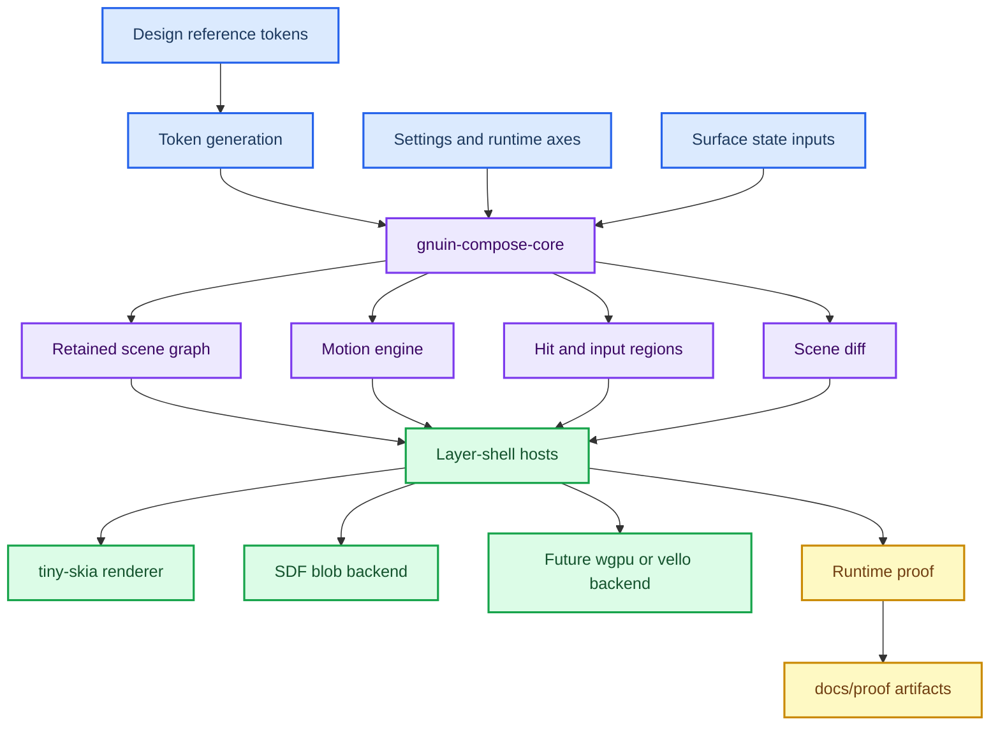
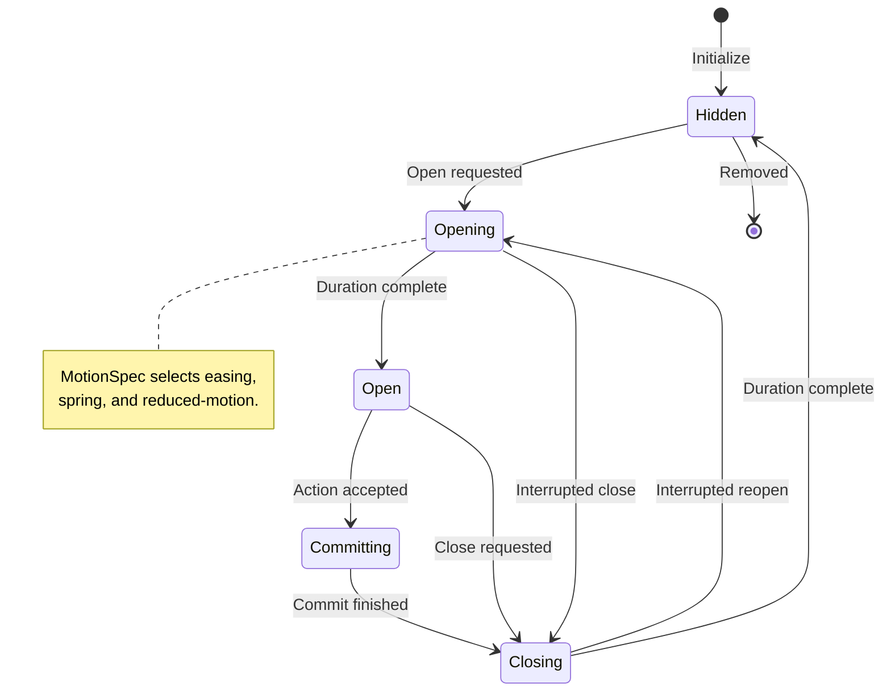
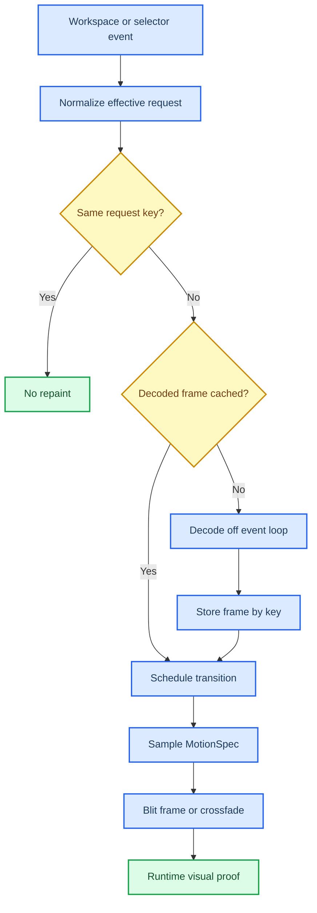

# GNU.IN Visual Runtime Engine Workplan

_Specification, planning record, and multi-step execution guide for the native Rust visual engine._

---

## Decision

The native Rust shell cannot reach credible 1:1 parity by porting each surface as
an isolated renderer. QML provided many affordances implicitly: retained item
identity, token lookup, easing, interruption, input regions, z-order, and
incremental repaint. In Rust, those affordances must be rebuilt explicitly and
shared.

The priority runtime nucleus is `engine/gnuin-compose-core`. It becomes the
framework-free visual engine for shell chrome and effect-heavy surfaces. Hosts
such as `gnuin-compose-host`, `gnuin-background`, `gnuin-bar`, `gnuin-dock`,
and future wallpaper/effect hosts should consume the same contracts instead of
duplicating local mini-engines.

This document is the planning authority for that work. It complements
`docs/COMPOSITION_ENGINE_SPEC.md`, which describes the original composition
engine model, and `docs/SHELL_NATIVE_RUST_ARCHITECTURE_PLAN.md`, which describes
the broader QML-to-Rust migration.

## Current baseline

The codebase already has the right anchors:

| Area | Current source | Status | Gap |
|---|---|---|---|
| Token resolution | `engine/gnuin-compose-core/src/tokens.rs` | Partial | Constants mirror design tokens but do not yet consume generated `tokens.json` or `gnu_theme.rs` directly |
| Scene graph | `engine/gnuin-compose-core/src/lib.rs` | Present | Needs more node kinds and richer payloads for all shell chrome |
| Reducer | `engine/gnuin-compose-core/src/compose.rs` | Present | Menu/bar/dock only; wallpaper/background is not yet expressed as retained nodes |
| Diff/invalidation | `engine/gnuin-compose-core/src/diff.rs` | Present | Needs explicit dirty-region and backend damage contract |
| Layout/input | `engine/gnuin-compose-core/src/layout.rs` and `Scene::input_region` | Present | Needs layer-shell focus/exclusive-zone policy attached to host contracts |
| Motion | `engine/gnuin-compose-core/src/anim.rs` and `src/motion.rs` | Advancing | New motion primitives exist; hosts still need to consume them |
| Backend | `engine/gnuin-compose-host/src/render.rs` | Partial | tiny-skia path works for simple surfaces; SDF/wgpu/vello remain backend decisions |
| Wallpaper | `engine/gnuin-background` + QML `WallpaperService` | Advancing | `gnuin-background` now exposes a source-only retained wallpaper model with `WallpaperKey`, per-output `WallpaperSlot`, current/pending state, decode generations, no-op handling for same effective workspace-slide requests, stale decode dropping, a bounded `WallpaperFrameCache`, and a Wayland host bridge that keeps the current frame visible while changed wallpapers decode and reuses cached composed frames before spawning decode workers. MotionSpec crossfade, parallax transform, and runtime proof still remain. |
| Assets/components | `engine/gnuin-asset-core` + `gnuin-hyprconf` + `engine/gnuin-bar` + `engine/gnuin-dock` | Advancing | SQLite-backed local manager exists for assets, AI/human tags, AI-assisted component manifest proposals from local assets, source-only dock and taskbar composition previews that return a suggested manifest plus validated `SettingsHandoff` and reader-facing `PreviewReviewCard`, JSON component manifests, source-only `ComponentMountPlan` records for imported subcomponents with resolved local assets and safety notes, per-monitor taskbar edit plans, dock affordance plans, component capabilities, required-asset validation, and `gnuin-assetctl` CLI workflows; `hyprconfd` settings handoff is live for `shell.taskbar.modules_json`; `gnuin-bar` consumes live per-monitor surface config writes (`visible`, `edge`, thickness from `height`/`width`/`thickness`, and density from `density=compact|normal|spacious`) plus widget slot writes (`left_widgets`, `center_widgets`, `right_widgets`) from that handoff, switches side-edge taskbars to vertical paint/hit layout, removes layer-shell reservation for hidden taskbars, and redraws when module content changes; `gnuin-dock::affordance` consumes source-planned dock affordance JSON in pure Rust, resolves card-deck pose data, `gnuin-dock::runtime` keeps host-facing module state, hover selection, and source-tested ingestion of already-received `hyprconfd` update lines, and the Wayland host can render a reviewed card-deck affordance through the local `GNUIN_DOCK_MODULES_JSON` preview path; source-only dev tests now prove asset-core preview handoffs paint a native card-deck dock frame and configure a renderable per-monitor vertical taskbar without compositor access, but live `shell.dock.modules_json` daemon subscription/apply remains pending; runtime import UI, full host-side module-node mounting, side-edge visual polish, and AI enrichment daemon are pending |
| Proof | `docs/proof` and render tests | Partial | Needs golden screenshot diffs, layer validation, and timing/state assertions per engine vertical |

## Target architecture

The target model is one shared visual contract and multiple thin hosts. The core
does not know Wayland, GPUI, QML, or GPU backends. Hosts mount the scene, drive a
real frame clock, and apply the layer-shell or xdg-shell protocol rules.



## Non-negotiable contracts

### Canonical tokens

All visual values must resolve through typed token channels. Ad hoc literal
values are allowed only as temporary bridge constants with a comment that names
the intended token source.

Required token channels:

| Channel | Examples | Source target |
|---|---|---|
| Color | surface, elevated surface, accent, border, danger, scrim | Generated design tokens |
| Radius | panel, blob, bar, row, dock, thumbnail | Generated design tokens |
| Spacing | row padding, panel padding, edge margin, dock gap | Generated design tokens |
| Typography | font family, size, weight, line-height, label truncation | Generated design tokens |
| Motion | duration, easing, spring response, reduced-motion policy | `shell.motion.*` + generated defaults |
| Layer | z-order bands, overlay priority, focusability | Engine constants and host policy |

Exit criterion: changing a token in the design source updates all native hosts
through generation or a clearly reviewed bridge layer.

### Retained scene graph

Every visual element must be a node with stable identity:

```rust
Node {
    id: NodeId,
    kind: NodeKind,
    rect: Rect,
    z: i32,
    state: NodeState,
    tokens: TokenBundle,
    payload: NodePayload,
}
```

Required rules:

- A node never watches another node's visibility to decide whether it paints.
- Geometry is assigned by the engine or host contract, not inferred by a stale
  cross-surface handshake.
- Z-order is data, not an implicit mount order.
- Hit regions and input regions are derived from the live scene.
- Diff is keyed by `NodeId`, not by host-local object lifetime.

### Motion

Motion is part of the semantic contract, not renderer decoration. Hosts may
choose how to interpolate pixels, but they must consume the same lifecycle and
interruption rules.



The shared API must cover:

- `MotionSpec` for duration, easing, spring, and reduced-motion
- `advance_motion(...)` for frame sampling
- `interrupt_motion(...)` for no-jump retargeting
- terminal snapping for reduced-motion
- state tests for open, close, interruption, and reduced-motion

### Rendering backend

The engine must not assume one renderer. The backend strategy is:

| Backend | Use now | Use later | Constraint |
|---|---|---|---|
| tiny-skia/software | Simple layer-shell surfaces, proof screenshots, CPU-stable tests | Keep for deterministic golden tests | Must remain fast enough for small overlays |
| SDF/blob uniforms | Organic membrane/backing shapes | Continue for blob parity | Must be a renderer for a node, not a separate owner |
| wgpu/vello | Complex visual parity, vector-heavy scenes, future animation | Evaluate after scene/motion contracts stabilize | Must not bypass scene graph or tokens |

### Layer-shell and input

Layer protocol is host work, but it must be driven by engine output:

| Policy | Engine output | Host responsibility |
|---|---|---|
| Pass-through | `Scene::input_region()` without background/blob nodes | Set Wayland input region |
| Click-away | `Scene::hit(x, y) == None` | Dispatch close if surface policy allows |
| Exclusive zone | Surface contract and node kind | Reserve edge space only for durable bars/docks |
| Focus | Surface contract and node state | Request keyboard focus only for search/text surfaces |
| Screen routing | `ComposeInput.screen` and output id | Reduce once per output and mount to the matching layer surface |

### Asset and module handoff

Importable visual affordances must move through an explicit local authority
boundary before any host mounts them. The current minimum contract is:

| Step | Owner | Contract |
|---|---|---|
| Catalog | `gnuin-asset-core` | SQLite records for assets, provenance, tags, summaries, and hashes |
| Admission | `gnuin-asset-core` | Component manifests validate required assets, kind, capabilities, and config fields |
| Operation | `gnuin-assetctl` | JSON CLI for asset upsert/search, AI metadata proposal/acceptance, AI-assisted component manifest proposal from a local asset, source-only dock and taskbar previews from local assets, component import, source-only component mount-plan export, taskbar plan export, and dock affordance plan export |
| Planning | `AssetManager` | `preview_taskbar_edit_from_asset` and `preview_dock_affordance_from_asset` compose local assets into reviewable, non-persisted manifests plus handoffs; `plan_component_mount` turns an imported `ImportableModule` into a source-only `ComponentMountPlan` with resolved local assets and safety notes; `TaskbarEditRequest` becomes a non-mutating `TaskbarEditPlan`; `DockAffordanceRequest` becomes a non-mutating `DockAffordancePlan`; all settings plans carry stable runtime keys |
| Handoff | `TaskbarEditPlan::to_settings_handoff` / `DockAffordancePlan::to_settings_handoff` | JSON schemas `gnu.in.taskbar-edit-plan.v1` targeting `shell.taskbar.modules_json` and `gnu.in.dock-affordance-plan.v1` targeting reserved `shell.dock.modules_json` |
| Persistence/apply | `gnuin-hyprconf` | `set_shell_key` validates JSON and `hyprconfd` routes live apply to `setTaskbarModulesJson` |
| Consumer model | `gnuin-dock::affordance` / `gnuin-dock::runtime` | Pure Rust parser for `gnu.in.dock-affordance-plan.v1`, default/fan/stack deck config resolution, card-deck tile poses for renderer/host use, and side-effect-free runtime ingestion of already-received `hyprconfd` panel-state/update lines |
| Rendering | `engine/gnuin-bar` / `engine/gnuin-dock` | `gnuin-bar` is the live taskbar consumer for per-monitor surface config writes (`visible`, `edge`, layer-shell reserved thickness, and `density=compact|normal|spacious`) plus widget slot writes (`left_widgets`, `center_widgets`, `right_widgets`) with basic vertical paint/hit layout for side-edge bars; a render integration test now builds a taskbar preview through `gnuin-asset-core`, resolves the handoff through `gnuin-bar::settings`, and paints the resulting vertical frame. `gnuin-dock::render` can now paint source-planned fan/stack card-deck affordances into a native tiny-skia frame and expose rotation/lift hit metadata; a dock integration test builds the preview through `gnuin-asset-core`, decodes the handoff through `gnuin-dock::affordance`, and paints the resulting frame without compositor or font. Full module rendering still needs scene-graph node mounting, capability dispatch, and polished side-edge/widgets. |

This is the first durable path for the larger goal: a dock, taskbar, wallpaper
engine, or visual-effect module can be cataloged locally, enriched by AI as a
proposal, accepted explicitly, and handed to the shell settings authority without
turning UI experimentation into uncontrolled runtime mutation.

### Visual proof

No native surface should be called parity-complete without evidence:

| Proof type | Required evidence |
|---|---|
| Unit tests | Token resolution, layout, diff, hit/input region, motion lifecycle |
| Render tests | Golden or deterministic pixel assertions for renderer output |
| Layer validation | `hyprctl layers -j` or equivalent namespace/geometry proof |
| Runtime screenshots | `docs/proof` screenshot per visible surface state |
| Timing/state tests | Motion state progression, reduced-motion snap, interruption no-jump |
| Regression case | A test or proof for the bug that motivated the work |

## Workstreams

### W1 - Token authority

Goal: make `TokenBundle` generated-token backed.

Steps:

1. Map `engine/blob.in/tokens.json` and generated Rust token exports to
   `gnuin-compose-core` fields.
2. Add missing semantic channels: danger, disabled, hover, text, radius,
   spacing, typography, motion.
3. Add a generator or bridge module that fails verify on drift.
4. Replace hard-coded constants in `tokens.rs` with generated values or a
   deliberately documented fallback.
5. Add tests comparing representative generated values to resolved bundles.

Exit criteria:

- `tools/verify.sh` catches token drift.
- `TokenBundle::resolve(...)` no longer hides important design constants.
- Docs identify the exact source file for every token group.

### W1a - Local asset and subcomponent registry

Goal: make GNU.IN customizable through a local, provenance-first registry rather
than one-off hard-coded assets in each host.

The first implementation is `engine/gnuin-asset-core`: a framework-free SQLite
store for:

- asset records with id, kind, path, hash, source/provenance, summary, and tags;
- AI-assisted and human tags with confidence metadata;
- AI-assisted component manifest proposals from local assets, with rationale,
  confidence, default UX config, required asset roles, and explicit review before
  import;
- source-only dock composition previews that chain local-asset component
  proposal, config validation, `DockAffordancePlan`, and `SettingsHandoff`
  without importing the component or applying live settings;
- importable component manifests with kind, entrypoint, capabilities, and
  required asset roles;
- stable JSON manifest documents that round-trip through the same typed model;
- component configuration fields, including per-monitor taskbar settings;
- non-mutating enrichment proposals that can be accepted into the catalog as
  `TagOrigin::Ai`;
- non-mutating component manifest proposals that can be imported only after an
  explicit review/import step;
- a source-only `AssetManager` workflow for registering assets, importing
  component documents, drafting enrichment, and explicitly accepting metadata;
- validated `TaskbarEditPlan` handoff payloads for per-monitor taskbar edits,
  including stable runtime keys, typed value validation, and a review card for
  operator-facing confirmation;
- validated `DockAffordancePlan` handoff payloads for card-deck dock affordance
  edits, including stable runtime keys, typed value validation, and a review
  card for operator-facing confirmation;
- `DockAffordancePreview` payloads for "try this local asset as a deck dock"
  flows, including the suggested manifest, plan, handoff, and non-persistence
  boundary;
- `PreviewReviewCard` payloads for dock/taskbar previews, including a title,
  target surface, summary, settings key, runtime keys, next actions, and safety
  notes so the first UI/agent experience is reviewable instead of raw JSON;
- `ComponentMountPlan` payloads for imported modules, including target surface,
  entrypoint, resolved local asset paths/hashes/provenance, capabilities,
  config fields, next actions, and safety notes before any host executes or
  mounts the component;
- a pure `gnuin-dock::affordance` consumer that parses those dock handoffs into
  deck style, fan angle, hover lift, runtime keys, and tile pose data;
- `gnuin-dock::render` application of those poses to tiny-skia frames and
  surface-local hit regions, with pixel-difference tests that do not require a
  compositor or font;
- a `gnuin-dock` integration test that consumes the actual `gnuin-asset-core`
  preview payload and paints a native card-deck dock frame, proving the registry
  output and dock consumer agree without a live host;
- validation that a component cannot be admitted unless its required local
  assets already exist in the registry.

This is intentionally not an execution engine yet. It is the local catalog layer
that lets a later UI/agent flow say "install this card-deck dock affordance" or
"install this per-screen taskbar editor" and prove which local assets, tags, and
capabilities, and editable per-monitor fields it is about to use before any
runtime mutation. It can also draft the exact taskbar or dock affordance config
writes a host or settings authority would need to apply later, without applying
them itself.

Steps:

1. Keep `gnuin-asset-core` source-only and verify-tested in `tools/verify.sh`.
2. Add importer helpers for design-reference packets and runtime-eligible asset
   folders; the source-only manager can already import manifest JSON once assets
   are registered.
3. Keep extending the local AI enrichment path: it can already propose
   tags/summaries, card-deck dock component manifests, and source-only dock
   handoff previews from local assets without silently mutating the catalog;
   accepted metadata becomes `TagOrigin::Ai`, while suggested manifests require
   explicit component import.
4. Keep the component manifest file format stable: JSON documents already
   round-trip through the same typed model as the SQLite store.
5. Connect visual hosts to the registry through read-only lookup first;
   `ComponentMountPlan` now resolves imported module assets/config/capabilities
   without executing or mounting the component, and `gnuin-bar`
   now consumes the reviewed settings handoff for per-monitor visibility,
   placement, density, and widget-slot writes while broader execution or live import
   remains a separate reviewed risk boundary.
6. Keep dock affordance live apply gated: `gnuin-dock::affordance`,
   `gnuin-dock::runtime`, and `gnuin-dock::render` can already resolve,
   hold, hover, ingest already-received `hyprconfd` update lines, and paint
   source-planned card-deck config, including an end-to-end source test from
   `gnuin-asset-core` preview to native frame paint and a host preview path via
   `GNUIN_DOCK_MODULES_JSON`; daemon subscription to live
   `shell.dock.modules_json` still waits for the host/socket contract review.

Exit criteria:

- A visual module such as a Balatro-like card-deck dock can be represented as a
  manifest with capabilities and required assets, proposed from a local asset by
  the AI-assisted registry path, previewed from that same local asset as a
  source-only manifest + dock handoff without persistence, and planned as a
  source-only dock affordance handoff with stable runtime keys; `gnuin-dock` can
  parse that handoff into deck config and render native fan/stack pose data
  without mounting it live, with a test that exercises the full
  asset-core-preview to dock-render path.
- A deep taskbar module, including per-screen taskbar editing, can be represented
  by the same manifest path with per-monitor configuration fields instead of a
  host-specific hard-code.
- Per-monitor taskbar edits can be planned as source-only handoff payloads with
  stable runtime keys, and `gnuin-bar` can consume the first live visibility,
  placement, density, and widget-slot writes from the settings/runtime apply
  boundary.
- Missing assets block component admission with a typed error.
- The manager refuses missing-asset manifests without persisting rejected
  components.
- Local search can find assets by kind, text, and AI/human tags without network
  access.
- The registry records provenance clearly enough that imported reference packs do
  not become silent runtime authority.

### W2 - Scene graph expansion

Goal: make the engine capable of representing shell chrome beyond menu/bar/dock.

Steps:

1. Add node kinds for background, wallpaper, thumbnail, launcher panel, OSD,
   notification, sidebar, overview, and modal overlay as they become real
   consumers.
2. Add payload structs per node kind instead of opaque host-local data.
3. Add dirty region / damage hints to `SceneDiff`.
4. Add invariant tests: one owner per node id, sorted layers, no live hidden
   nodes, no input on non-interactive backing nodes.
5. Update host renderers incrementally; do not block all surfaces on one large
   migration.

Exit criteria:

- A new surface can be added by defining state -> scene -> render, not by
  inventing a custom lifecycle.
- Diff output is specific enough for hosts to avoid full repaint when geometry
  and tokens are unchanged.

### W3 - Motion engine adoption

Goal: replace host-local timers and linear transitions with shared motion.

Steps:

1. Use `MotionSpec` in `TokenBundle` or a sibling motion table.
2. Wire `advance_motion(...)` into `gnuin-compose-host`.
3. Use `interrupt_motion(...)` for close/reopen and menu switch cases.
4. Add reduced-motion settings consumption from `shell.motion.reduced_motion`.
5. Add visual proof for interrupted open/close state.

Exit criteria:

- Opening, closing, interrupted, and reduced-motion behavior is tested in core.
- Hosts no longer encode independent easing constants for the same semantic
  surface role.

### W4 - Wallpaper engine vertical

Goal: stop workspace-slide wallpaper reloads and establish the first retained
background/effect pipeline.

Current implementation:

- `gnuin-background` treats duplicate effective wallpaper requests as no-ops.
- `ClearWallpaper` and `SetEnabled` avoid repaint when state is unchanged.
- The pure library now exposes `WallpaperKey`, `WallpaperSlot`,
  `WallpaperSlotAction`, and `WallpaperDecodeResult` as the retained per-output
  state contract.
- `WallpaperSlot` tracks `current`, `pending`, decode generation, and transition
  intent. Workspace changes that resolve to the same effective frame update the
  workspace metadata without repainting or decoding.
- `WallpaperFrameCache` stores bounded, already-composed ARGB frames keyed by
  path, output size, fill mode, and tint. Cache lookup deliberately ignores
  workspace and output name because those fields do not change the composed
  pixels.
- The Wayland host consumes slot actions: a first wallpaper still paints fallback
  while decoding, but a real change with an existing current frame does not
  repaint fallback before the async decode finishes. Cached effective frames
  promote pending slot state without spawning a worker, decoded frames are cached
  after generation validation, and stale decode results are dropped by
  generation.

Target engine:



Required data model:

```rust
struct WallpaperKey {
    output: String,
    workspace: Option<i32>,
    path: String,
    fill_mode: FillMode,
    tint_argb: u32,
    tint_alpha: f32,
    output_size: (u32, u32),
}

struct WallpaperSlot {
    current: Option<WallpaperKey>,
    pending: Option<WallpaperKey>,
    decoded_generation: u64,
    transition: Option<WallpaperTransition>,
}

struct WallpaperFrameCache {
    capacity: usize,
    frames: Vec<(WallpaperKey, Vec<u32>)>,
}
```

Steps:

1. Land duplicate-request no-op and tests. **Done.**
2. Add explicit `WallpaperKey` and per-output state slots. **Done.**
3. Add decode cache keyed by effective path, output size, fill mode, and tint.
   **Source/host behavior done.**
4. Preserve old frame while decoding a new one; never repaint fallback during a
   same-key workspace slide. **Source/host behavior done; runtime visual proof
   still pending.**
5. Add crossfade driven by `MotionSpec`.
6. Add optional parallax as a transform over retained frame, not a reload.
7. Add runtime proof: workspace slide with same wallpaper produces no fallback
   flash; real wallpaper change transitions once.

Exit criteria:

- Sliding between workspaces with the same effective wallpaper does not issue a
  fallback repaint.
- Real wallpaper changes are visible without blocking the event loop.
- Proof is stored in `docs/proof` with screenshots or video frames plus status
  output.

### W5 - Backend and renderer hardening

Goal: make rendering backends interchangeable under the same scene contract.

Steps:

1. Keep tiny-skia as deterministic software backend and golden-test reference.
2. Move SDF blob rendering behind a node renderer interface.
3. Define a renderer trait that accepts `Scene`, `SceneDiff`, and
   `MotionSample`.
4. Evaluate wgpu/vello only after W1-W3 are stable.
5. Document backend choice per host.

Exit criteria:

- A backend swap does not change `ComposeInput`, `Scene`, node ids, token
  resolution, input regions, or motion semantics.

### W6 - Proof automation

Goal: reduce visual regression proof to repeatable commands.

Steps:

1. Add deterministic render tests for each node family.
2. Add golden images for tiny-skia outputs where stable.
3. Add proof capture helpers that open each promoted surface, capture it, and
   write a manifest under `docs/proof`.
4. Add layer assertions for namespace, z layer, focusability, geometry, and
   input region where observable.
5. Add timing tests for motion lifecycle and interruption.

Exit criteria:

- `tools/verify.sh` covers core invariants.
- Release promotion has an explicit visual proof path for changed surfaces.

## Multi-step execution plan

### Milestone M0 - Foundation lock

Status: in progress.

Deliverables:

- `motion.rs` in `gnuin-compose-core`
- `COMPOSITION_ENGINE_SPEC.md` updated with the priority lock
- this workplan
- tactical duplicate-request wallpaper no-op

Verification:

```sh
cargo fmt --manifest-path engine/gnuin-compose-core/Cargo.toml
cargo test --manifest-path engine/gnuin-compose-core/Cargo.toml
cargo test --manifest-path engine/gnuin-compose-core/Cargo.toml --features serde
cargo test --manifest-path engine/gnuin-background/Cargo.toml --features wayland
tools/verify.sh
```

### Milestone M1 - Token bridge

Deliverables:

- generated token bridge for compose-core
- token drift check in verify
- expanded `TokenBundle` or split `VisualTokens` / `MotionTokens`
- `gnuin-asset-core` remains green in verify as the local registry foundation
  for runtime-eligible tokens/assets/modules

Verification:

- generated files match `engine/blob.in/tokens.json`
- token resolution tests pass for color, radius, spacing, typography, motion

### Milestone M2 - Motion host adoption

Deliverables:

- `gnuin-compose-host` uses `MotionSpec`
- no host-local easing constants for menu open/close
- interruption tests for menu switch and click-away reopen

Verification:

- core tests
- render proof at 0%, 50%, 100% progress for at least one opening and closing
  transition

### Milestone M3 - Wallpaper retained engine

Deliverables:

- `WallpaperKey`
- per-output slots
- bounded effective-frame decode cache
- no fallback repaint on duplicate requests
- crossfade transition on real changes

Verification:

- duplicate effective request unit test
- cache hit and bounded eviction unit tests
- changed wallpaper request retains old frame while decoding test
- stale decode generation drop test
- runtime workspace-slide proof

### Milestone M4 - Scene expansion

Deliverables:

- background/wallpaper nodes
- launcher/OSD/notification/sidebar node candidates as real consumers demand
- dirty-region hints in diff

Verification:

- no full repaint when only hover/motion changes a small node
- input regions exclude non-interactive backings

### Milestone M5 - Backend evaluation

Deliverables:

- tiny-skia reference backend documented
- SDF blob backend node renderer isolated
- wgpu/vello evaluation note with concrete adoption criteria

Verification:

- backend parity screenshots against the same scene fixture
- no scene contract changes for backend swap

### Milestone M6 - Release proof rail

Deliverables:

- proof capture command or script
- `docs/proof` manifest shape for changed surfaces
- layer validation output captured per promoted host

Verification:

- changed surfaces have screenshots and layer records before promotion is
  called complete

## Work package template

Each implementation slice should be tracked with this shape:

```markdown
### WP-N - Short title

Goal:

Inputs:
- Source files:
- Runtime settings:
- Existing proof:

Changes:
- Core:
- Host:
- Docs:

Verification:
- Unit:
- Render:
- Runtime:
- Proof artifact:

Rollback:
- Source rollback:
- Runtime rollback:

Open gaps:
- ...
```

## Ownership boundaries

| Repo/path | Owns |
|---|---|
| `gnu.in-os/engine/gnuin-compose-core` | Shared visual semantics: tokens, scene graph, diff, input region, motion |
| `gnu.in-os/engine/gnuin-compose-host` | Layer-shell host and software rendering for composed surfaces |
| `gnu.in-os/engine/gnuin-background` | Native background/wallpaper host until wallpaper nodes are fully integrated |
| `gnu.in-shell` | QML policy producers and fallback surfaces while migration is incomplete |
| `gnu.in-design-reference` | Canonical visual source, imported design references, token provenance |
| `docs/proof` | Runtime and screenshot evidence for changed visual surfaces |

Do not move runtime authority into the Obsidian vault. Do not edit
`~/.local/share/gnuin-shell` directly. Promotion must go through
`tools/promote-latest.sh` after build verification.

## Open risks

| Risk | Impact | Mitigation |
|---|---|---|
| Token drift between design reference and compose-core | Visual parity claims become unreliable | Generate or verify token bridge from source |
| Backend-first work bypasses scene semantics | Another fragmented renderer stack | Require every backend to consume `Scene` and `MotionSample` |
| Wallpaper decode blocks or flashes fallback | Workspace transitions feel broken | Retain old frame, decode async, repaint only on effective change |
| Motion differs per host | Rust surfaces feel incoherent | Centralize motion spec and host sampling |
| Proof remains manual | Regression risk rises with every surface | Add deterministic render tests and proof capture scripts |

## Immediate next actions

1. Verify and commit M0: motion primitives, docs, and wallpaper duplicate no-op.
2. Promote only if the runtime wallpaper fix is intended to land immediately.
3. Start M1 token bridge before adding more independent visual polish to
   individual hosts.
4. Treat wallpaper retained-state work as the first engine consumer after M0,
   because the observed workspace-slide reload is a concrete user-visible bug.
